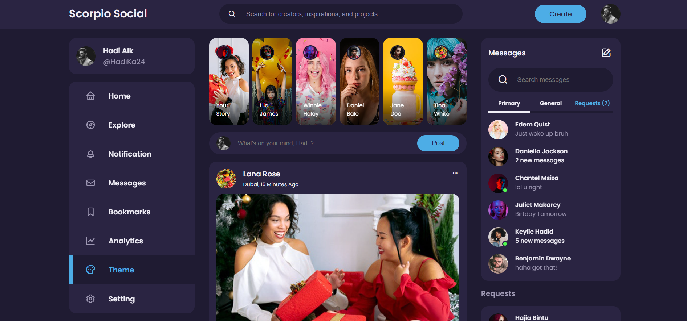
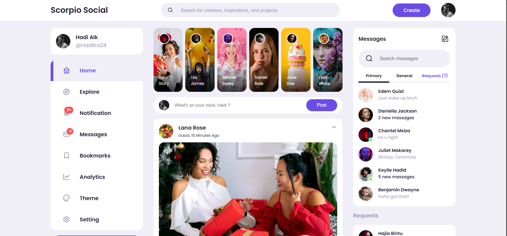
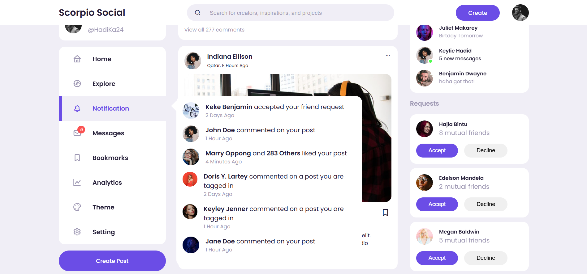
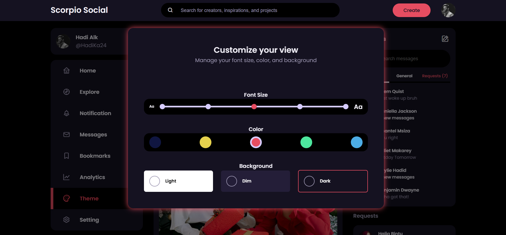

# 📱 Scorpio Social – Responsive Social Media Website

A modern and fully responsive **social media website** with theme customization, built using **HTML, CSS, and JavaScript**.



## 🚀 Features

- 🎨 **Theme Customization** – Switch between different themes.
- 💬 **Messaging System** – Chat with friends in real-time.
- 🔔 **Notifications** – Stay updated with interactions on your posts.
- 📸 **Stories Feature** – Share temporary images and updates.
- 📊 **Analytics Dashboard** – Track user engagement.
- 📱 **Fully Responsive** – Works across all screen sizes.

## 🛠️ Tech Stack

- **HTML5** – Structuring the content.
- **CSS3** – Styling and animations.
- **JavaScript (ES6+)** – Interactive elements.
- **Flexbox & Grid** – For a modern, responsive layout.

## 📷 Screenshots

| Home Page | Notifications | Theme Customization |
|-----------|--------------|----------------------|
|  |  |  |


## 🎯 How to Use

1. **Clone the Repository**  
   ```bash
   git clone https://github.com/hadialkari/Responsive-Social-Media-Website-.git
   ```

2. **Open `index.html` in your browser**  
   Simply open the file, and the site will load.

## 📜 License

This project is **open-source** 
